# CI/CD y Despliegue en la Nube

Esta sección contiene las evidencias de que nuestra API ha sido automatizada y desplegada exitosamente en ambientes separados de QA y Producción en Microsoft Azure.

## URLs Públicas
* **Ambiente de QA:** [https://restaurante-bella-ciao-qa-hhg5eghkerenczhs.centralus-01.azurewebsites.net/swagger-ui/index.html](https://restaurante-bella-ciao-qa-hhg5eghkerenczhs.centralus-01.azurewebsites.net/swagger-ui/index.html) 

* **Ambiente de PROD:** [https://restaurante-bella-ciao-prod-brasfrckexbne7dc.centralus-01.azurewebsites.net/swagger-ui/index.html](https://restaurante-bella-ciao-prod-brasfrckexbne7dc.centralus-01.azurewebsites.net/swagger-ui/index.html) 

## Evidencias de Ejecución

### 1. Ejecución del Pipeline en Verde
La automatización de GitHub Actions completando exitosamente las fases de pruebas (Test), empaquetado (Build) y Despliegue (Deploy):

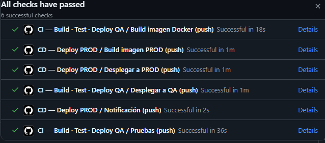

### 2. Aprobación Manual en Producción
Evidencia del control humano en el ambiente de producción (Environment Protection Rules):

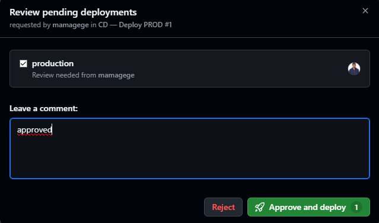

### 3. Trazabilidad en Docker Hub
Etiquetas dinámicas y semánticas creadas de forma automática por el pipeline:

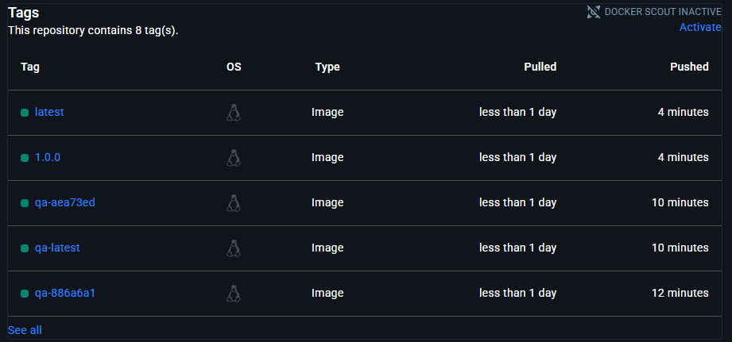

### 4. Contenedor en Azure
El contenedor corriendo dentro de la infraestructura de Azure App Service:

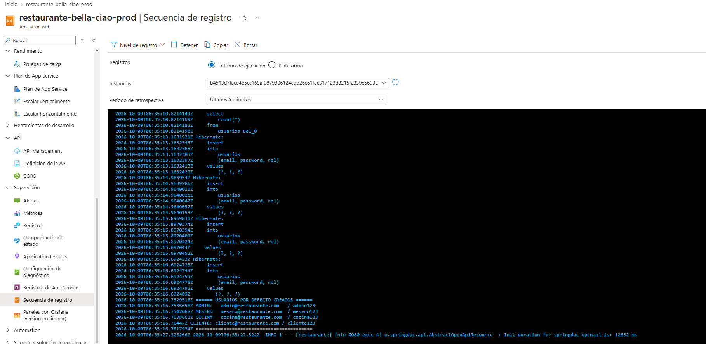

### 5. Configuración de Secrets
Listado de variables seguras inyectadas al pipeline:

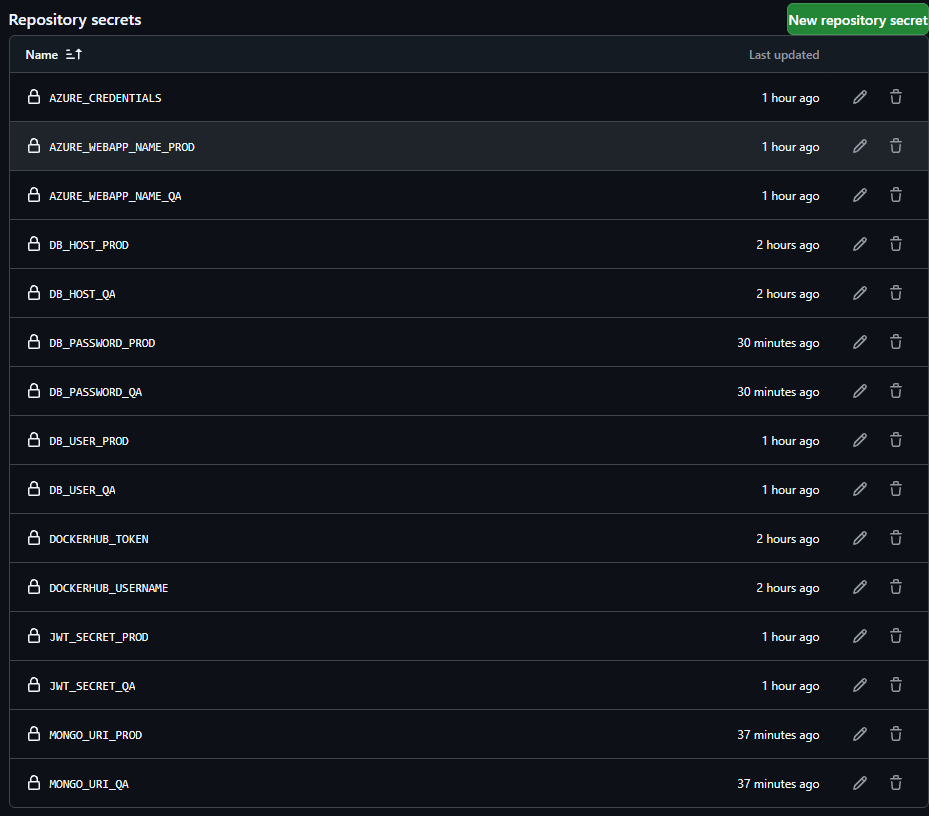

## Arquitectura de Despliegue

La siguiente arquitectura ilustra el flujo de integración continua, registro de imágenes, y la inyección a dos ambientes aislados de Azure (QA y PROD), cada uno con sus respectivas bases de datos independientes.

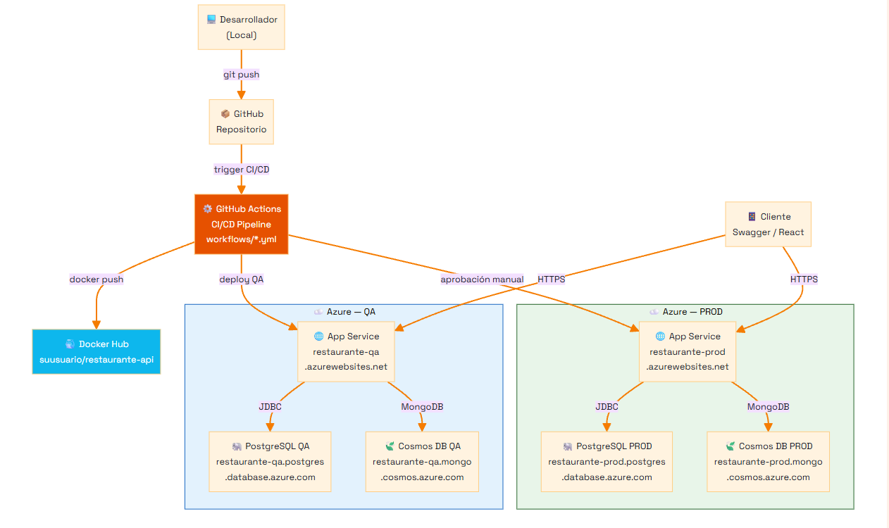

### Estrategia de Ambientes
* **QA (Quality Assurance):** Despliegue automático con cada cambio en `main` o `develop`. Se utiliza para que el equipo pruebe integraciones y valide funcionalidades sin afectar a los usuarios reales.
* **PROD (Production):** Despliegue altamente controlado activado únicamente mediante tags de versión. Contiene su propia base de datos aislada y requiere la aprobación explícita de un líder del equipo antes de recibir nuevo tráfico.

## Lecciones Aprendidas y Retos Superados (Troubleshooting)

Durante la implementación y despliegue del proyecto en Azure App Services, enfrentamos varios escenarios reales de la industria que requirieron depuración y ajustes específicos de infraestructura:

### 1. El misterio del Caché de Docker en GitHub Actions
* **El Problema:** El pipeline fallaba en la etapa de construcción con el error `Cache export is not supported for the docker driver`.
* **La Solución:** Fue necesario agregar el paso `docker/setup-buildx-action@v3` en los workflows antes del build. Esto activa Docker Buildx, permitiendo que la característica avanzada de guardar caché (`cache-to: type=gha,mode=max`) funcione correctamente en GitHub Actions, reduciendo los tiempos de construcción a la mitad en ejecuciones posteriores.

### 2. Inyección segura de Secrets en formato JSON
* **El Problema:** El paso `azure/appservice-settings@v1` fallaba con `Given Settings object is not a valid JSON`. Esto ocurre porque las contraseñas reales (como `DB_PASSWORD`) pueden contener comillas dobles, espacios o saltos de línea invisibles que rompen la interpolación de texto plana en el YAML.
* **La Solución:** En lugar de inyectar los strings en duro (`"${{ secrets.DB_PASSWORD }}"`), utilizamos la función nativa de GitHub Actions `${{ toJson(secrets.DB_PASSWORD) }}`. Esto "sanitiza" y escapa dinámicamente cualquier caracter especial, garantizando que el JSON del App Service siempre sea válido y seguro.

### 3. URL dinámica por Políticas de Seguridad de Azure
* **El Problema:** Al ingresar a `restaurante-bella-ciao-qa.azurewebsites.net`, la página no cargaba.
* **La Solución:** Azure ahora habilita por defecto una política llamada *"Nombre de host predeterminado único seguro"*, la cual añade un hash aleatorio a la URL para evitar ataques de suplantación de dominio. La URL real y funcional es generada dinámicamente, por ejemplo: `restaurante-bella-ciao-qa-hhg5eghkerenczhs.centralus-01.azurewebsites.net`.

### 4. Límite de Cuota en App Service Plan Gratuito (F1)
* **El Problema:** El contenedor arrojó error `403 - This web app is stopped`. 
* **La Solución:** El plan gratuito (F1) ofrece un límite estricto de 60 minutos de CPU diarios. Ya que Spring Boot y Docker consumen bastantes recursos durante el arranque y las pruebas, la cuota se agotó rápidamente. La solución arquitectónica (cubierta por Azure for Students) fue hacer un **Escalamiento Vertical (Scale Up)** de la infraestructura, pasando al plan **Básico (B1)** que otorga 1 Core y 1.75GB de memoria dedicados 24/7 sin límite de tiempo.

### 5. Configuración de Base de Datos PostgreSQL
* **El Problema:** Spring Boot arrancaba pero se estrellaba instantáneamente arrojando en los logs `FATAL: database "restaurante" does not exist`. 
* **La Solución:** En los servicios PaaS como Azure Database for PostgreSQL, la creación del "servidor" no implica la creación de las bases de datos de usuario. Tuvimos que ingresar al portal de Azure, ir a la sección "Bases de datos" dentro de nuestro PostgreSQL, y agregar manualmente la base de datos vacía `restaurante` para que Spring Data JPA pudiera inyectarle el esquema y las tablas al arrancar.

### 6. Cadena de conexión oculta en Azure Cosmos DB (MongoDB)
* **El Problema:** Spring Boot fallaba al inicializar los repositorios Mongo con el error `Database name must not be empty`.
* **La Solución:** La cadena de conexión predeterminada (Connection String) que entrega el portal de Azure Cosmos DB viene sin el nombre de la base de datos mapeada. Para resolverlo, editamos los *Secrets* en GitHub y añadimos manualmente el nombre de la base de datos `restaurante` justo después de la barra de ruta y antes de los parámetros TLS (`...com:10260/restaurante?tls=true...`).

## Infraestructura Desplegada en Azure

A continuación se presentan las evidencias de los recursos provisionados exitosamente en Azure para soportar ambos ambientes (QA y Producción).

### App Service Plan (Plan de Linux)
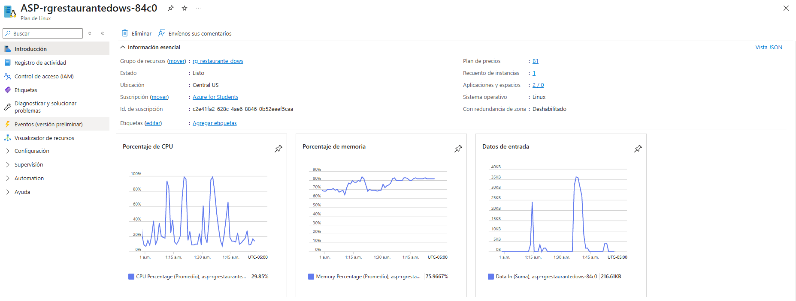

### App Services (Web Apps)
**Ambiente de Producción:**
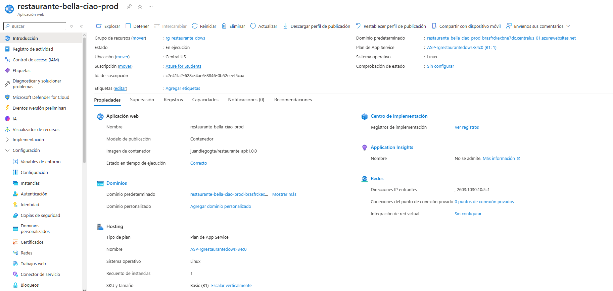

**Ambiente de QA:**
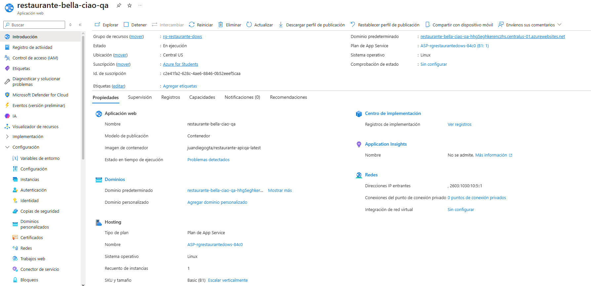

### Bases de Datos Relacionales (PostgreSQL)
**Instancia de Producción:**
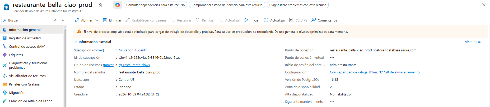

**Instancia de QA:**
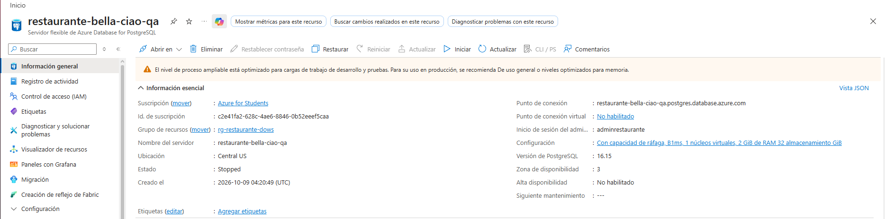

### Bases de Datos No Relacionales (Cosmos DB - MongoDB)
**Instancia de Producción:**
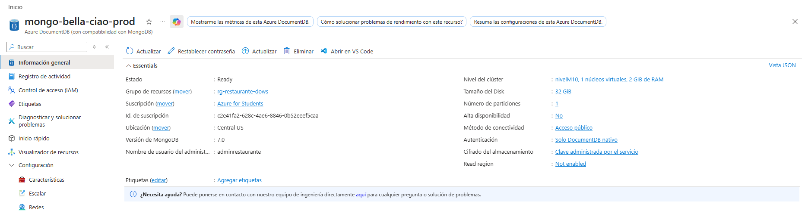

**Instancia de QA:**
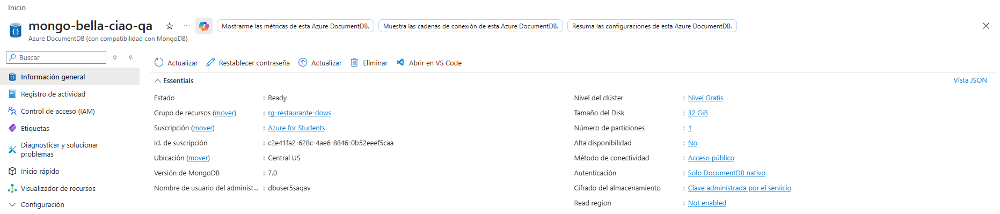
