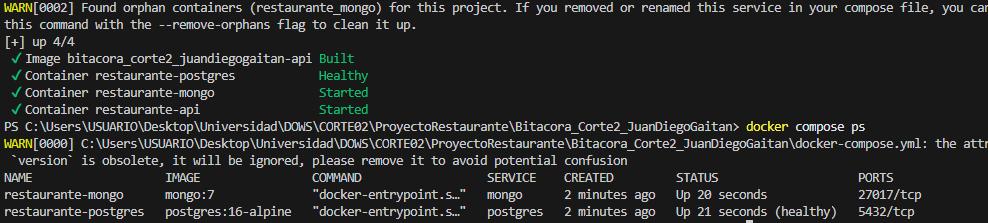
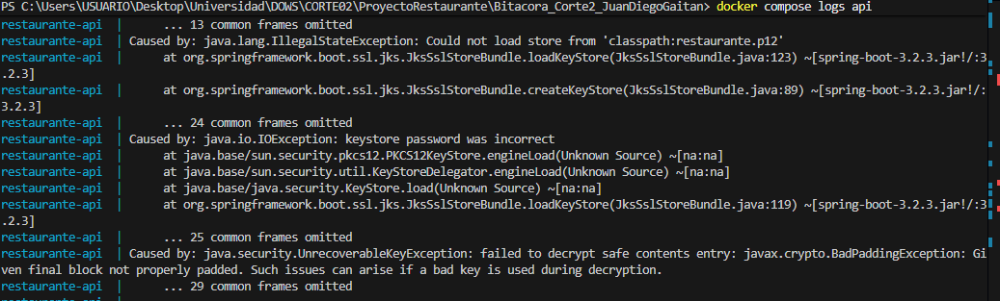
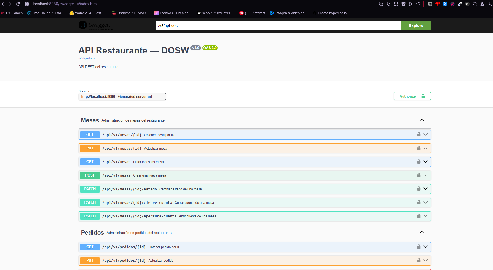
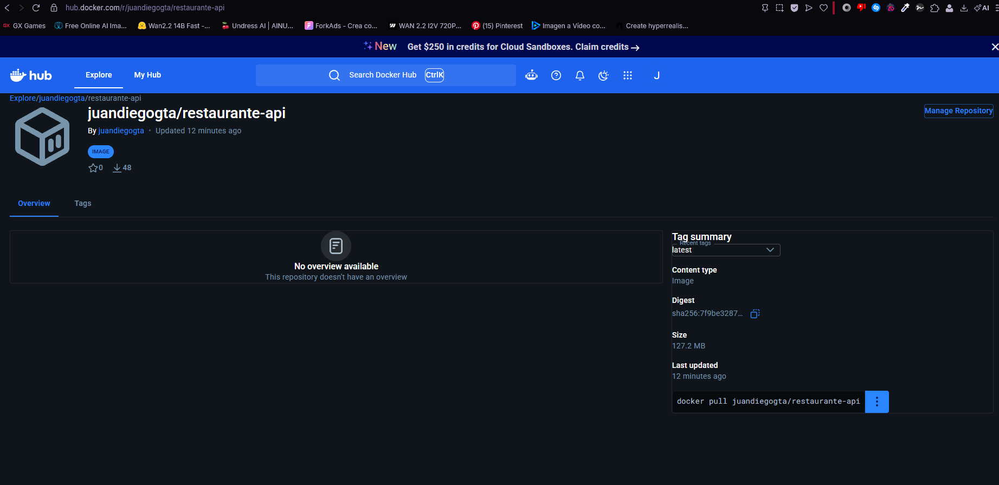

# 🐳 Dockerización - Proyecto Restaurante API

Esta sección contiene toda la evidencia y configuración necesaria para desplegar la arquitectura completa de microservicios (API, PostgreSQL y MongoDB) localmente utilizando contenedores.

## 🚀 Instrucciones para Levantar el Stack

Para encender toda la infraestructura con un solo comando, ubícate en la raíz del proyecto y ejecuta:

```bash
docker compose up --build -d
```
*(El flag `--build` asegura que la imagen de la API de Java siempre se re-compile con los últimos cambios de código, y el flag `-d` corre todo en segundo plano sin secuestrar tu terminal).*

---

## 🔒 Variables de Entorno Requeridas (`.env`)
El proyecto requiere un archivo oculto `.env` en la raíz (ignorado por Git). Debes crearlo guiándote del archivo `.env.example` proporcionado en el repositorio.

* **`JWT_SECRET`**: Clave criptográfica ultra segura en Base64 utilizada para firmar los tokens de seguridad de los usuarios del restaurante.
* **`SSL_KEYSTORE_PASSWORD`** *(opcional dependiendo de config)*: Contraseña para la llave SSL.

---

## 📸 Evidencias de Ejecución (Paso 8)

### 1. Estado Saludable de los Contenedores
Todos los contenedores funcionando y entrelazados bajo la red de Docker Compose. El comando `docker compose ps` nos confirma que la API está operativa y que las bases de datos de Mongo y PostgreSQL están perfectamente sanas y listas para recibir peticiones:



### 2. Logs de Arranque de Spring Boot
La API de Java confirmando la exitosa inyección de las variables de entorno para conectarse tanto al cluster relacional (PostgreSQL) como al documental (MongoDB). Los logs comprueban un arranque sin errores:



### 3. Swagger Operando en el Contenedor
La interfaz gráfica de nuestra documentación API, sirviéndose a través del contenedor de Docker y exponiendo el puerto 8080 hacia nuestro navegador anfitrión:



---

## ☁️ Publicación en Docker Hub (Paso 6)
La imagen de la API del restaurante ha sido exitosamente empaquetada, etiquetada y publicada en la nube pública de Docker, dejándola disponible para ser consumida desde cualquier clúster de Kubernetes o servidor de CI/CD.

* **Link Público:** [https://hub.docker.com/r/juandiegogta/restaurante-api](https://hub.docker.com/r/juandiegogta/restaurante-api)

### Captura del Repositorio en la Nube
El repositorio público en Docker Hub evidenciando las múltiples actualizaciones y la etiqueta de la última compilación (*latest*):


