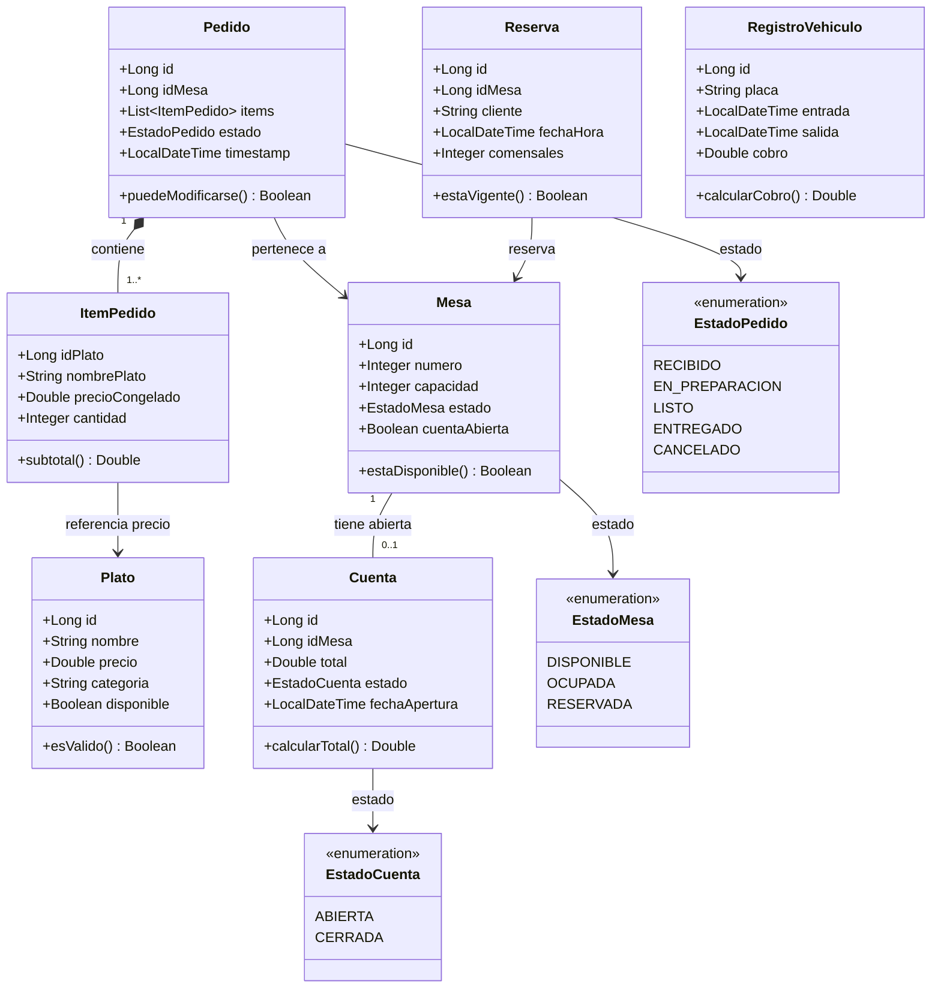

# Documentación del Modelo del Restaurante

## SECCIÓN: El sistema completo — dominios y objetos

### Explicación de conceptos teóricos
Antes de escribir una línea de código, es fundamental visualizar el sistema completo. El sistema se divide en dominios funcionales, categorizados según su importancia operativa:

1. **🔴 Núcleo (Sin esto no hay restaurante):**
   - **Carta & Platos:** El menú que ve el cliente. Incluye ver carta, gestionar platos y disponibilidad.
   - **Mesas:** El salón del restaurante. Gestiona la capacidad, estado y apertura/cierre de cuentas.
   - **Pedidos & Cocina:** El flujo central. Controla el ciclo de vida del pedido (RECIBIDO → EN_PREPARACIÓN → LISTO → ENTREGADO).
   - **Cuenta & Pago:** El cierre del ciclo. Congela precios, asocia pedidos a la mesa y registra el pago.

2. **🟡 Soporte operativo (Hace que funcione bien):**
   - **Reservas:** Permite agendamiento previo o walk-ins.
   - **Reportes:** Inteligencia del negocio (platos más pedidos, ingresos).

3. **🟢 Diferenciador del concepto (Lo hace único):**
   - **Parqueadero:** Accesos y cobros de vehículos.
   - **Reglas del concepto:** Toppings, términos de carne, reseñas de platos.

### Detalle de la implementación paso a paso
1. **Identificación de Objetos Centrales:** Se modelaron las entidades fundamentales (`Plato`, `Mesa`, `Pedido`, `Cuenta`, `ItemPedido`, `Reserva`, `RegistroVehiculo`).
2. **Definición de Atributos y Comportamientos:** A cada objeto se le asignaron sus propiedades y métodos descriptivos (ej. `Mesa.estaDisponible()`, `Pedido.puedeModificarse()`).
3. **Establecimiento de Relaciones:** Se trazó el mapa de navegación entre objetos (cardinalidades y dependencias lógicas) que dictará cómo los Services interactúan entre sí.
4. **Priorización del Flujo:** El código deberá construirse atacando primero el Núcleo (Platos y Mesas) antes de expandirse a características de Soporte o Diferenciadores.

### Aspectos claves
El diseño del dominio se rige por **tres relaciones cruciales** que deben cumplirse estrictamente:
1. **Pedido $\rightarrow$ ItemPedido:** Un pedido tiene muchos ítems. Es vital que cada ítem **congele el precio** del plato en el momento en que se ordena. Si el plato sube de precio mañana, el pedido histórico no debe alterarse.
2. **Mesa $\rightarrow$ Cuenta:** Una mesa tiene como máximo **una cuenta abierta a la vez**. Es imposible registrar un nuevo pedido en una mesa sin aperturar una cuenta previamente.
3. **RegistroVehiculo:** Es un objeto totalmente **independiente** del resto del dominio (no se ata ni a mesas ni a pedidos), permitiendo flujos separados.

Adicionalmente, las reglas específicas (como "las pizzas no pueden tener más de 5 toppings") no pertenecen al modelo estructural de base de datos, sino que entran vía **validaciones de negocio en el Service**.

### Resumen
El modelo del dominio es el corazón del restaurante. Su estructuración divide el esfuerzo de desarrollo en tres fases lógicas (Núcleo, Soporte, Diferenciadores) y establece las fronteras relacionales de las entidades. Entender que el precio se congela en el ítem del pedido, o que la cuenta y la mesa están íntimamente ligadas por un estado, es lo que garantiza que la lógica de negocio final (Services) sea robusta y coherente.

### 🧠 Preguntas de Repaso — Modelo
**¿Por qué el precio se guarda en el `ItemPedido` si ya existe en `Plato`?**
Porque el precio del `ItemPedido` es el "precio congelado" en el momento exacto en que el cliente ordena. Si el restaurante actualiza el precio del `Plato` en la base de datos al día siguiente, el pedido antiguo no debe verse afectado.

**¿Puede un cliente hacer un pedido en una mesa que no tiene una cuenta abierta?**
No. La regla del negocio establece que la mesa debe tener una cuenta abierta antes de poder recibir o asociar pedidos.

**¿Qué cardinalidad existe entre Mesa y Cuenta?**
De $1$ a $0..1$. Una mesa solo puede tener una única cuenta abierta simultáneamente.

---

### Diagrama de Clases — Dominio Completo (Mermaid)

---

## SECCIÓN 01: Estándares de un API REST & Códigos HTTP

### Explicación de conceptos teóricos
Un API REST robusto requiere estándares inquebrantables para garantizar coherencia en la comunicación Cliente-Servidor. Las reglas fundamentales son:
- **URLs limpias:** Uso de sustantivos en plural y jerarquías (`/platos/{id}` en lugar de `/getPlato`).
- **Verbos HTTP semánticos:** La acción la define el verbo HTTP (`GET` para leer, `POST` para crear, `PUT` para reemplazar todo, `PATCH` para actualizar parcialmente, `DELETE` para eliminar).
- **Códigos de Estado (Status Codes):** La respuesta siempre debe ir acompañada del código HTTP semánticamente correcto según la operación:
  - **GET:** `200 OK` (éxito), `404 Not Found` (no existe), `403 Forbidden` (sin permisos).
  - **POST:** `201 Created` (éxito al crear), `400 Bad Request` (fallo de formato/`@Valid`), `409 Conflict` (duplicidad), `422 Unprocessable Entity` (violación de regla de negocio).
  - **PUT / PATCH:** `200 OK` (actualizado exitosamente).
  - **DELETE:** `204 No Content` (eliminado exitosamente sin body).
- **200 vs 201:** `200` es éxito general. `201` significa "recurso creado".
- **404 vs 422:** `404` el recurso no existe. `422` el recurso existe, el formato está bien, pero el negocio rechaza la operación.
- **400 vs 422:** `400` formato incorrecto o incompleto. `422` formato correcto pero infringe restricciones de dominio.

### Detalle de la implementación paso a paso
1. **Verificación de Códigos de Éxito:** Se revisaron todos los Controladores para confirmar que los métodos `POST` retornan explícitamente `HttpStatus.CREATED` (201) y que los métodos `DELETE` retornan `ResponseEntity.noContent().build()` (204).
2. **Mapeo Centralizado de Errores:** Se analizó el `GlobalExceptionHandler`, verificando que la traducción de excepciones internas a códigos HTTP sea exacta:
   - `RecursoNoEncontradoException` $\rightarrow$ `404 NOT_FOUND`
   - `ConflictoException` $\rightarrow$ `409 CONFLICT`
   - `ReglaDeNegocioException` / `EstadoInvalidoException` $\rightarrow$ `422 UNPROCESSABLE_ENTITY`
   - `MethodArgumentNotValidException` $\rightarrow$ `400 BAD_REQUEST`
   - `AccessDeniedException` $\rightarrow$ `403 FORBIDDEN`
3. **Documentación OpenAPI/Swagger:** Se validó que las interfaces (`PlatoApi`, `PedidoApi`, etc.) exponen correctamente estos códigos de respuesta previstos a nivel de especificación Swagger.

### Aspectos claves
- **Idempotencia:** La implementación garantiza que los verbos `GET`, `PUT` y `DELETE` sean seguros o idempotentes (el resultado repetido no altera el estado de forma acumulativa), mientras que `POST` es manejado cuidadosamente por validaciones de negocio (`409 Conflict` para prevenir duplicados).
- El manejo de `422 Unprocessable Entity` aísla los errores sintácticos (`400`) de los errores semánticos o del dominio, brindando una experiencia excepcional al cliente del API.

### Resumen
La API se adhiere cabalmente a los estándares REST. Garantiza rutas basadas en sustantivos, y maneja una delegación perfecta de responsabilidades mediante el uso semántico estricto de verbos HTTP y sus correspondientes códigos de respuesta. A través de un `GlobalExceptionHandler`, los errores están centralizados y estandarizados, evitando la filtración de excepciones internas `500` a favor de códigos `400`, `404`, `409` y `422` altamente descriptivos, asegurando consistencia pura y dura en todo el proyecto.

### 🧠 Preguntas de Repaso — Estándares REST
**¿Cuál es la diferencia entre 200 y 201?**
200 significa "todo bien, aquí están los datos". 201 significa específicamente "creé algo nuevo". Un `POST` exitoso siempre debe devolver 201.

**¿Cuál es la diferencia entre 404 y 422?**
404 indica que el recurso solicitado no existe. 422 indica que el recurso existe y el formato de la petición es correcto, pero la operación viola una regla de negocio del dominio.

**¿Cuál es la diferencia entre 400 y 422?**
400 se usa cuando el formato del request es incorrecto (ej. falló `@Valid`). 422 se usa cuando el formato está bien, pero el negocio lo rechaza (ej. estado de transición inválido).

---

## SECCIÓN 01-B: Versionamiento de API — Cambiar sin romper

### Explicación de conceptos teóricos
El versionamiento de API asegura que, ante cambios estructurales en los datos, los clientes externos (como el frontend) no se rompan por incompatibilidades de contrato. 
- **¿Cuándo versionar?** Cuando el cambio no es retrocompatible: se elimina un campo, se cambia el tipo de dato, se renombra un campo obligatorio o se altera la semántica del endpoint.
- **¿Cuándo NO versionar?** Cuando el cambio es puramente aditivo: se agrega un campo opcional, un nuevo endpoint o mejoras de rendimiento.
- **Estrategias:** 
  - *URL Versioning (`/api/v1/...`):* La más visible y recomendada. Es fácil de probar y visualizar en Swagger.
  - *Header Versioning:* Más "pura" pero difícil de probar y confusa.
  - *Query Param:* Ensucia las URLs y complica el cacheo, no recomendada.

### Detalle de la implementación paso a paso
1. **Auditoría de Controladores:** Se revisaron las anotaciones `@RequestMapping` de todos los Controladores (`AuthController`, `PlatoController`, `MesaController`, `CuentaController`, `PedidoController`).
2. **Confirmación de Prefijo Global:** Se validó que, desde el inicio del proyecto, todos los endpoints implementan obligatoriamente la convención de *URL Versioning*, anteponiendo `/api/v1/` a sus rutas base (ej. `@RequestMapping("/api/v1/platos")`).
3. **Mapeo en OpenAPI:** Al utilizar el prefijo a nivel de clase controladora, las especificaciones Swagger/OpenAPI heredan naturalmente el versionamiento, agrupando los endpoints bajo sus contratos explícitos.

### Aspectos claves
- **El costo de la retroactividad:** Añadir un versionamiento cuando el frontend ya está conectado es sumamente costoso; el proyecto evitó esta deuda técnica estableciendo `/api/v1/` como regla de oro desde el primer endpoint.
- **Contrato de API:** Una URL versionada es una promesa estricta al cliente de que la estructura que consume no se romperá repentinamente, garantizando la estabilidad operativa del frontend.

### Resumen
La aplicación emplea la estrategia de *URL Versioning* de forma consistente y global. Todas las piezas del sistema operan actualmente bajo la versión `/api/v1/`, sentando una base robusta y escalable que permitirá futuras iteraciones estructurales (como migraciones de tipos de datos o refactorización de respuestas en los DTOs) sin afectar la estabilidad del cliente que esté consumiendo la versión actual en producción.

### 🧠 Preguntas de Repaso — Versionamiento
**¿Agregar un campo nuevo a la respuesta requiere una nueva versión de la API?**
No, si el campo es opcional y aditivo. Los clientes que no lo conocen simplemente lo ignoran. Solo se requiere una nueva versión cuando se elimina o modifica estructuralmente algo que el cliente ya consume y espera recibir.

**¿Por qué es mejor el URL versioning que el header versioning para este proyecto?**
Porque es visible explícitamente en el enrutamiento (ej. `/api/v1/`), es fácil de probar directamente en el navegador o Postman, se refleja nativamente en la documentación (Swagger) y es amigable y comprensible para todos los miembros del equipo sin necesidad de inyectar o manipular headers HTTP a mano.

---

## SECCIÓN 02: Swagger UI / OpenAPI — La doc que se escribe sola

### Explicación de conceptos teóricos
Sin Swagger, los equipos de desarrollo sufren con colecciones de Postman desactualizadas y documentos muertos en Word; QA no puede probar eficientemente sin levantar todas las herramientas y el Frontend desconoce los campos correctos del contrato. 
**OpenAPI** es el estándar (el contrato en JSON/YAML) que describe tu API. **Swagger UI** es la herramienta que lee ese contrato y lo muestra de forma visual, interactiva y de uso inmediato en el navegador. Gracias a esto, la documentación está "viva": si cambias el código, la documentación cambia sola sin esfuerzo manual.

### Detalle de la implementación paso a paso
1. **Dependencia Maven:** Se constató que `pom.xml` ya incluye la dependencia `springdoc-openapi-starter-webmvc-ui`, lo que levanta automáticamente Swagger en proyectos Spring Boot 3.
2. **Configuración Global:** Se analizó la clase `config/SwaggerConfig.java`, donde se inyecta el bean `OpenAPI` con la meta-información del proyecto (título "API Restaurante — DOSW", descripción y versión). También se validó que se configuró dinámicamente el esquema de seguridad (`BearerAuth` con JWT) para poder probar endpoints protegidos directamente desde la UI.
3. **Anotaciones de Endpoints:** Se verificó la implementación de interfaces de documentación separadas (ej. `PlatoApi`, `PedidoApi`), las cuales utilizan las anotaciones `@Tag` (para categorizar en la UI) y `@Operation` / `@ApiResponse` (para documentar la descripción y la estructura de éxito/error de cada ruta).

### Aspectos claves
- **Aislamiento de la documentación:** Mantener las anotaciones de Swagger en interfaces dedicadas a documentar (`*Api`) deja las clases concretas (`*Controller`) inmaculadas y legibles, enfocadas únicamente en el enrutamiento puro.
- **Pruebas integradas:** Al configurar el esquema de seguridad directamente en Swagger, QA y Frontend pueden probar la autenticación ingresando un Token JWT en la plataforma sin necesidad de saltar a clientes externos como Postman.

### Resumen
El proyecto adoptó a la perfección el estándar OpenAPI mediante la dependencia moderna `springdoc-openapi`. No solo la documentación de los contratos se autogenera de forma declarativa, sino que se enlazó con la capa de seguridad, proveyendo a cualquier consumidor del API una herramienta visual completa, confiable y 100% sincronizada con el código fuente en todo momento.

### 🧠 Preguntas de Repaso — Swagger
**¿Cuál es la URL donde puedes ver Swagger en tu proyecto?**
`http://localhost:8080/swagger-ui/index.html`

**¿Qué hace `@Tag` en el Controller?**
Agrupa los endpoints bajo un nombre estructurado en la interfaz de Swagger UI, facilitando enormemente la navegación cuando hay múltiples controladores.

**¿Por qué usamos `springdoc-openapi` en vez de `springfox`?**
Porque Springfox no tiene soporte activo ni es compatible nativamente con Spring Boot 3. `springdoc-openapi` es la herramienta moderna de reemplazo y totalmente compatible.

---

## SECCIÓN 03: Logging — El registro de vida de tu restaurante

### Explicación de conceptos teóricos
Un sistema en producción a ciegas es un riesgo inaceptable. El logging es el registro estructurado de los eventos del sistema, clasificable por severidad para filtrar el ruido dependiendo del entorno:
- **TRACE:** Detalle microscópico (solo en desarrollo activo).
- **DEBUG:** Diagnóstico interno (ej. "Buscando id=5").
- **INFO:** Eventos normales de negocio (ej. "Pedido #42 creado").
- **WARN:** Situaciones anómalas que no rompen el flujo (ej. "Intento de crear un plato duplicado").
- **ERROR:** Fallo crítico que requiere atención inmediata (ej. fallo al interactuar con base de datos).

La interfaz recomendada en Java es SLF4J, cuya implementación se simplifica radicalmente gracias a la anotación `@Slf4j` de Lombok, la cual inyecta la instancia del Logger en la clase de forma transparente.

### Detalle de la implementación paso a paso
1. **Limpieza de Boilerplate:** Se buscaron y eliminaron las sentencias manuales `private static final Logger log = LoggerFactory.getLogger(...);` y sus importaciones en todos los servicios core (`PlatoServiceImpl`, `PedidoServiceImpl`, `MesaServiceImpl`, `CuentaServiceImpl`, `AuthServiceImpl`).
2. **Inyección con Lombok:** Se anotó la capa `@Service` de cada uno de estos módulos con `@Slf4j`.
3. **Configuración por Paquetes:** Se añadió el bloque de configuración `logging` en el archivo `application.yml` para aislar el ruido:
   - Raíz general (`root`): `INFO`
   - Lógica de Dominio (`com.dows.bitacora2.restaurante`): `DEBUG` (para monitorear a detalle nuestra propia lógica).
   - Framework web de Spring (`org.springframework.web`): `WARN` (para callar trazas HTTP por defecto).

### Aspectos claves
- **Eficiencia y limpieza:** Gracias a `@Slf4j`, el código queda enfocado 100% en negocio y no en la inicialización estática de herramientas de terceros.
- **Trazabilidad sin ruido:** Al limitar el framework web a `WARN`, nuestra consola se mantendrá inmaculada, mostrando la historia real que cuentan los loggers inyectados en las clases del restaurante.

### Resumen
Se migró la estrategia de instanciación manual de *Loggers* hacia el estándar declarativo apalancado por Lombok (`@Slf4j`). A su vez, se formalizó el registro de niveles de severidad en el `application.yml`, lo que permite flexibilizar la agresividad de las bitácoras según el entorno en el que esté desplegado el restaurante, todo esto sin necesidad de recompilar el proyecto.

### 🧠 Preguntas de Repaso — Logging
**¿Corrió el proyecto con `@Slf4j`? ¿Aparece algo en la consola al hacer una petición?**
Sí, al delegar el registro en SLF4J, Spring Boot lo enruta nativamente a Logback. Al configurar tu paquete en `DEBUG` o `INFO`, los trazos configurados en tus *Services* fluirán exitosamente hacia la salida estándar (consola).

**¿Qué nivel usas para el flujo exitoso de negocio?**
`INFO` — es el estándar para el "camino feliz" y auditoría de eventos de negocio. `DEBUG` se reserva para detallar el "cómo" funciona el código por debajo, y `WARN` / `ERROR` se lanzan exclusivamente cuando el flujo sale de su operación esperada.

---

## SECCIÓN 04: Validaciones — Input vs Negocio

### Explicación de conceptos teóricos
Existe una frontera arquitectónica crítica entre la forma de un dato y el significado de un dato. Mezclarlos produce código espagueti.
- **Validación de Input (El Formato):** Responde a "¿Viene el campo?", "¿Es un texto vacío?", "¿El número es negativo?". Se gestiona de forma declarativa y temprana en los DTOs, usando Bean Validation (`@NotNull`, `@NotBlank`, `@Min`, `@Size`). Retorna automáticamente `400 Bad Request` si falla.
- **Validación de Negocio (El Dominio):** Responde a "¿Ya hay un plato con este nombre?", "¿Puedo cancelar un pedido que ya está cocinándose?". Requiere acceso a la base de datos o lógica de negocio. Reside estrictamente en la capa `@Service`, disparando excepciones propias (ej. `ReglaDeNegocioException`, `ConflictoException`) que el `GlobalExceptionHandler` mapea a `409 Conflict` o `422 Unprocessable Entity`.

### Detalle de la implementación paso a paso
1. **Refactorización de DTOs:** Se migró la estructura base de los DTOs (`PlatoRequestDTO`, `PedidoRequestDTO`, `ItemPedidoRequestDTO`) desde clases tradicionales hacia **`records`** inmutables de Java, perfectos portadores estáticos de datos.
2. **Bean Validation en Records:** Se implementaron las anotaciones (`@NotBlank`, `@Positive`, `@Size`, `@NotEmpty`) directamente en los atributos del record.
3. **Validación Automática en Controller:** Se comprobó que el parámetro de los Controladores recibe el payload precedido de la anotación `@Valid`, delegándole a Spring la intercepción y rechazo inmediato de formatos inválidos (`400 Bad Request`).
4. **Excepciones de Dominio en Service:** Se corrigió una fuga de abstracción en `PlatoServiceImpl.java` donde se lanzaba una genérica `RuntimeException` al detectar nombres duplicados. Se refactorizó para lanzar explícitamente `ConflictoException`, la cual el interceptor traduce pulcramente a un HTTP `409 Conflict`. A su vez, `PedidoServiceImpl` ya lanza `ReglaDeNegocioException` (`422`) cuando detecta combinaciones inválidas en la máquina de estados.

### Aspectos claves
- **Responsabilidad Única:** Al separar responsabilidades, el método `.crear(dto)` del Service recibe un DTO que *tiene garantizado* que sus campos no son nulos y cumplen las reglas base. Esto limpia la lógica del Service, permitiéndole dedicarse enteramente a evaluar reglas ricas del dominio.
- **Eficiencia:** Las peticiones mal formadas mueren en la entrada del `Controller` antes de iniciar costosas transacciones de base de datos.

### Resumen
La aplicación ahora distingue nítidamente el proceso de validación. La sanidad sintáctica del *Input* la resuelve automáticamente Spring Boot en el borde de la red usando *records* y *Bean Validation*, reportando errores `400`. La viabilidad semántica del *Negocio* la gobierna exclusivamente la capa de Servicio, disparando sus propias excepciones tipadas que se transforman, de forma centralizada y limpia, en respuestas `409` y `422`.

### 🧠 Preguntas de Repaso — Validaciones
**¿Dónde pusiste la validación de "nombre duplicado"? ¿En el DTO o en el Service?**
En la capa **Service** (dentro de `PlatoServiceImpl`). Es una validación de negocio porque requiere consultar dinámicamente el estado del sistema (la base de datos) para comparar si el nombre proporcionado colisiona con uno existente. El DTO es incapaz de conectarse al repositorio, su labor es estática.

**¿Tienes `@Valid` en el parámetro del Controller? Prueba mandando un body sin el campo nombre — ¿qué responde?**
Sí, los controladores poseen `@Valid`. Al mandar un payload sin el campo obligatorio `nombre`, se dispara una `MethodArgumentNotValidException`. El `GlobalExceptionHandler` captura esto y devuelve estructuradamente un HTTP `400 Bad Request` indicando "El nombre es obligatorio", sin que la petición contamine la capa de negocio.

---

## SECCIÓN 05: GlobalExceptionHandler — El gerente que intercepta los problemas

### Explicación de conceptos teóricos
En un sistema robusto, cuando el código estalla (una base de datos caída o un nulo inesperado), no puedes dejar que el cliente reciba un horrendo `500 Internal Server Error` acompañado de un *stack trace* crudo. Eso es poco profesional y, lo que es peor, expone vulnerabilidades de seguridad a posibles atacantes.
El `GlobalExceptionHandler` (marcado con `@RestControllerAdvice`) actúa como el "gerente del restaurante": intercepta todas las excepciones no capturadas de los controladores y las traduce a una respuesta amable y uniforme (`ErrorResponseDTO`), devolviéndola al cliente con el código HTTP apropiado. 

### Detalle de la implementación paso a paso
1. **Refactorización del ErrorResponseDTO:** Se actualizó el record `ErrorResponseDTO` para incorporar un útil método de fábrica estático (`of(...)`). Este encapsula el cálculo de la fecha (`LocalDateTime.now()`) para limpiar la inicialización y hacer la sintaxis del handler más legible.
2. **Reemplazo de Loggers Manuales:** Al igual que en la capa de servicios, se removió la inicialización *boilerplate* del logger manual (`LoggerFactory.getLogger`) en favor del uso unificado de la anotación `@Slf4j` dentro del interceptor.
3. **Mapeo de Excepciones Típicas:** El manejador global mapea sistemáticamente los errores a su estatus semántico correcto.
   - `MethodArgumentNotValidException` → `400 Bad Request`.
   - `RecursoNoEncontradoException` → `404 Not Found`.
   - `ConflictoException` → `409 Conflict`.
   - `EstadoInvalidoException` o `ReglaDeNegocioException` → `422 Unprocessable Entity`.
4. **Barrera de Seguridad (Fallback):** Todo error insospechado que no tenga un *handler* específico será capturado en la base de la cascada de fallos (`Exception.class`), forzando un retorno ciego `500` con un mensaje neutro ("Error inesperado del servidor") y dejando el *stack trace* completo de forma oculta pero segura en nuestros *logs* del servidor.

### Aspectos claves
- **Uniformidad:** No importa si falló un plato, un pedido o la base de datos, el cliente siempre recibirá el mismo molde JSON predecible de error.
- **Sin Try-Catch Regados:** Los controladores jamás ensucian su código con try-catch. Delegan la responsabilidad asumiendo que "el gerente se hará cargo".
- **Seguridad Sensible:** El `500` general oculta intencionalmente `ex.getMessage()` de la cara pública de la API, impidiendo filtraciones informativas que comprometan el clúster.

### Resumen
La gestión de fallos es ahora transversal, unificada y elegante. Usando el patrón `RestControllerAdvice`, hemos asegurado que cada tipo de interrupción operativa, desde validaciones semánticas rotas (`400`) hasta bugs internos (`500`), sea atrapada y descrita bajo un estándar férreo. Esto dignifica la experiencia del frontend y resguarda la información interna.

### 🧠 Preguntas de Repaso — Exception Handler
**¿Por qué no usar try-catch en el Controller?**
Si cada Controller gestiona sus fallos, estarías repitiendo la misma lógica `try-catch` indefinidamente. Además, se correría el riesgo de que distintos endpoints emitan formatos de error diferentes (uno en String, otro en un JSON distinto). Con `@RestControllerAdvice`, el mapeo está centralizado y garantizas un formato inmutable de API.

**¿Por qué el `@ExceptionHandler` de `Exception.class` va al final?**
La evaluación de intercepciones en Spring Boot sigue un modelo jerárquico. Si el manejador de clase genérica `Exception.class` fuera el primero en interceptar (o atrapara todo sin cuidado), absorbería excepciones de negocio precisas (como un `ConflictoException`) impidiendo que sean enviadas con su código HTTP especializado (`409`). Al ubicarse al final, sirve como malla o red de seguridad exclusiva para los errores no catalogados.

---

## SECCIÓN 06: Streams — Manejo de listas y colecciones

### Explicación de conceptos teóricos
Los *Streams* en Java son una abstracción que permite procesar secuencias de elementos de forma funcional y declarativa. Aunque se enseñan como la forma ideal para consultar colecciones en memoria, son igual de valiosos cuando tienes una base de datos conectada, ya que sirven para realizar transformaciones y reportes analíticos complejos sobre conjuntos de datos que ya has extraído a la capa de negocio.

Operaciones clave de *Streams* implementadas:
- `map()`: Transforma elementos uno a uno (ej. mapear de `Entidad` a `DTO`).
- `flatMap()`: Aplana estructuras anidadas (ej. listas dentro de listas, convirtiendo múltiples pedidos con ítems en un solo flujo continuo de ítems).
- `anyMatch()`: Realiza un *short-circuit*; detiene el procesamiento y retorna `true` en el milisegundo exacto en que la condición se cumple, siendo infinitamente más eficiente que un `filter(...).count() > 0`.
- `groupingBy()`: Realiza el equivalente a un `GROUP BY` de SQL, pero operando dinámicamente en memoria.

### Detalle de la implementación paso a paso
1. **Creación del DTO Estructural:** Para materializar las ventajas del reporte avanzado sin depender estrictamente de sentencias SQL brutas, se creó el record `ResumenDiaDTO`.
2. **Lógica de Agrupación en el Servicio:** Se inyectó el método `resumenDelDia()` en `PedidoServiceImpl.java` aplicando streams avanzados sobre `pedidoRepository.findAll()`:
   - Se procesó el ingreso total aplastando la jerarquía de los ítems con `.flatMap()`, aislando sus precios totales con `.mapToDouble()` y reduciéndolos a una métrica con `.sum()`.
   - Se construyó un diccionario estadístico con `.collect(Collectors.groupingBy(...))` sobre la secuencia aplanada de ítems, mapeando el nombre del plato contra una cuenta de frecuencias absolutas generada por `Collectors.counting()`.
3. **Exposición en Controlador:** Se habilitó un nuevo endpoint en el `PedidoController` mapeado en la ruta HTTP `GET /api/v1/pedidos/resumen` para poder solicitar al sistema la construcción del analítico agrupado.

### Aspectos claves
- **Procesamiento Declarativo:** El código en `resumenDelDia()` no tiene ni un solo bloque `for` manual ni estructuras `if`. Se lee de arriba hacia abajo y describe "el qué" se quiere, reduciendo los riesgos de mutar variables externas.
- **Potencia Híbrida:** Dado que nuestro proyecto sí implementa una base de datos PostgreSQL, utilizamos la base para traer el universo crudo y usamos los `Streams` en el backend para orquestar la consolidación del reporte gerencial de caja, todo en pocas líneas de código.

### Resumen
Los *Streams* dotan al lenguaje Java de una herramienta insuperable para la manipulación y cruce de datos tabulares sin recurrir a ciclos forizados y código espagueti. Aprovechando `flatMap` y `groupingBy`, logramos sintetizar toda la actividad del restaurante en un reporte financiero en memoria, demostrando la inmensa versatilidad analítica de la capa de servicio.

### 🧠 Preguntas de Repaso — Streams
**¿Cuál es la diferencia entre `map()` y `flatMap()`?**
`map()` mantiene una relación de multiplicidad 1 a 1: Si entran 10 pedidos, salen 10 valores. `flatMap()` es un aplanador multidimensional: Si entran 10 pedidos, y cada pedido contiene 3 ítems en su interior, `flatMap()` destruye las barreras anidadas y deja expuesto un flujo horizontal ininterrumpido de 30 ítems listos para ser contados o reducidos.

**¿Por qué usar `anyMatch()` en vez de `filter().count() > 0`?**
Por el concepto fundamental de *Short-Circuit*. Si tienes miles de elementos y la coincidencia buscada se topa al inicio del flujo, `anyMatch()` aborta la búsqueda y retorna instantáneamente. `filter().count()` es ciego en este aspecto, procesando inútilmente el 100% de la colección solo para sacar un conteo inoficioso.

**¿Qué hace `groupingBy()`?**
Toma el flujo final y lo reempaqueta en formato `Map<K, V>`. Emplea una función selectora para establecer la llave de agrupación (ej. agrupar por el nombre del plato) y aplica un colector *downstream* para generar el valor final de esa cubeta (ej. sumar las veces que se repitió o recolectar sus subtotales). Es la pieza central de la inteligencia de negocios en memoria.

---

## SECCIÓN 07: Pruebas con Mocks, Stubs y el diagrama de componentes

### Explicación de conceptos teóricos
En la pirámide de pruebas, las pruebas unitarias deben ser rápidas, deterministas e independientes. Si al probar la lógica del `Service` permites que este hable con la Base de Datos o con el Controlador de red, ya no tienes una prueba unitaria, sino de integración (lenta y frágil).
Para aislar el *Subject Under Test (SUT)* (en nuestro caso, `PlatoServiceImpl`), utilizamos dobles de prueba:
- **Stub:** Responde pasivamente con datos secos y pre-programados.
- **Mock:** Actúa como un Stub, pero adicionalmente "espía" y verifica si fue llamado, con qué parámetros y cuántas veces (usando `verify()` de Mockito).
- **Spy:** Envuelve un objeto real interceptando y monitoreando sus llamadas.

### Detalle de la implementación paso a paso
1. **Configuración de JUnit 5 + Mockito:** El archivo `PlatoServiceImplTest.java` fue habilitado con la anotación `@ExtendWith(MockitoExtension.class)`, permitiendo a Mockito orquestar el entorno.
2. **Definición de SUT y Mocks:**
   - La clase real a probar (`PlatoServiceImpl`) se instancia con `@InjectMocks`.
   - Sus colaboraciones externas (`PlatoRepository`, `PlatoEntityMapper`, `IPlatoValidator`) se falsearon con anotaciones `@Mock`.
3. **Escenarios Programados y Cubiertos:**
   - **Happy Path:** Se probaron `.obtenerPorId()` y `.crear()`, simulando el repositorio (`when(repo...thenReturn(...))`) y confirmando aserciones como `assertNotNull()` y `assertEquals()`.
   - **Duplicado/Conflicto:** Se probó `.crear()` forzando a que `existsByNombreIgnoreCase()` retorne `true`. Se comprobó que se lanza `ConflictoException` y que el repositorio **nunca** guarda el registro intruso usando `verify(repo, never()).save(any())`.
   - **No Encontrado:** Se buscó un ID falso esperando un `RecursoNoEncontradoException`. Se comprobó matemáticamente que la capa de *Mapping* nunca se despertó usando `verifyNoInteractions(entityMapper)`.
   - **Lista Vacía:** Se simuló un retorno de lista vacía para `obtenerTodos()`, confirmando que el servicio no colapsa con NullPointers, devolviendo un arreglo vacío `[]`.

### Aspectos claves
- **Arquitectura de Pruebas GIVEN-WHEN-THEN:** Cada prueba respeta rigurosamente las fases de Arreglo (Given: preparar mocks), Actuación (When: ejecutar método real del SUT) y Aserción (Then: verificar resultados y verificar invocaciones a los mocks).
- **Cobertura Cíclica:** No solo probamos el "camino feliz", probamos 4 ramas críticas que todo `Service` debe sortear sin caerse de forma incontrolada.

### Resumen
Gracias a JUnit y Mockito, nuestro `PlatoServiceImpl` fue sometido a pruebas de laboratorio pulcras. Sin requerir levantar el motor de Spring Web ni la base de datos PostgreSQL, logramos verificar milimétricamente su robustez lógica simulando escenarios de éxito y fracaso a voluntad.

### 🧠 Preguntas de Repaso — Pruebas Unitarias
**¿Cuál es la diferencia entre `@Mock` y `@InjectMocks`?**
`@Mock` fabrica un cascarón vacío (doble) de una dependencia externa (ej. `PlatoRepository`). `@InjectMocks` en cambio instancia la clase **real** y viva que deseas auditar (el SUT, ej. `PlatoServiceImpl`), inyectándole por constructor automática y silenciosamente todos los cascarones `@Mock` que hayas declarado en tu archivo de prueba.

**¿Qué verifica `verify(mock, times(1)).metodo()`?**
Es una aserción de comportamiento, no de estado. Verifica que durante la ejecución de la prueba (fase *When*), la clase bajo evaluación dio la orden al Mock de ejecutar ese método específico exactamente una sola vez. Si el método jamás se llamó, o se llamó por error dentro de un bucle, la prueba fallará protegiendo así la semántica interna del componente.

---

## SECCIÓN 08: Diagramas de Secuencia y Arquitectura UML

### Explicación de conceptos teóricos
En ingeniería de software, para entender verdaderamente un sistema, necesitamos analizarlo desde diferentes ángulos. Los tres diagramas pilares para la arquitectura son:

1. **Diagrama de Clases (Dominio):**
   Muestra las entidades puras y agnósticas del negocio (`Plato`, `Pedido`, `Mesa`), sus atributos directos y sus relaciones. 
   - 🚫 *La regla de oro:* No lleva anotaciones de Frameworks (`@Entity`, `@Service`) ni lleva objetos de transferencia (`DTOs`).

2. **Diagrama de Componentes (General y Específico):**
   Muestra la modularidad y el ensamblaje del sistema. 
   - El *General* visualiza bloques enormes (El Backend Core, el Frontend React, la Base de Datos, las APIs de terceros).
   - El *Específico* visualiza los engranajes internos usando notación estricta (Lollipop ○— y Socket ⌒): muestra a `PlatoController` consumiendo el puerto de la interfaz `IPlatoService`, y al componente `PlatoServiceImpl` implementándola.
   - 🚫 *La regla de oro:* Aquí no van atributos, métodos minuciosos ni código interno.

3. **Diagrama de Secuencia:**
   Muestra la *Línea de Vida (Lifeline)* de una interacción a lo largo del tiempo cronológico. Enseña quién le lanza un mensaje a quién para cumplir una historia de usuario (ej. "Flujo para confirmar un Pedido").
   - Es dinámico: Utiliza *Activation bars*, mensajes síncronos/asíncronos y fragmentos lógicos (`alt` para if/else, `opt` para condicionales sencillos, `loop` para iteraciones).

### Aspectos claves
- **Fantasmas DTO:** Los DTOs jamás se diagraman en UML estructural. Son simples vehículos desechables de paso, no son entidades ni componentes de procesamiento.
- **Evitar Mutaciones UML:** El error más letal en los parciales de arquitectura es cruzar universos: clavar un controlador en el diagrama de clases, o poner un atributo String en el diagrama de componentes.
- **Reutilización Estratégica:** Las agrupaciones mandan. Si `PedidoService` requiere verificar inventario, no reinventa la rueda ni hace queries manuales a la base de datos de platos; debe **inyectar y reutilizar** el contrato `IPlatoService`. Las dependencias siempre se fijan a nivel de interfaces.

### Resumen
El diseño estructurado antecede al desarrollo salvaje. Categorizar las funcionalidades en *Controllers* cohesivos, mapear el dominio asilado y diseñar las interacciones cronológicas a través de diagramas de secuencia dictamina la limpieza del código. Un backend profesional no es más que la transcripción literal a código Java de estos tres contratos UML (Clases, Componentes y Secuencia) elaborados previamente.

### 🧠 Preguntas de Repaso — Arquitectura UML
**¿Dónde va `PlatoServiceImpl` — en el diagrama de clases o en el de componentes?**
Pertenece estrictamente al **Diagrama de Componentes Específico**. Su naturaleza es ser una pieza estructural de procesamiento (un `@Service`), no es una representación purista de un objeto de la vida real.

**¿El diagrama de componentes general muestra `PlatoController`?**
No. El diagrama general muestra el ecosistema a nivel de cajas negras ("El Backend Spring Boot", "El Frontend", "La Base de Datos"). Entrar al micromanagement de qué Controladores viven dentro del Backend rompe por completo el nivel de abstracción del diagrama macro.

**¿Los DTOs van en el diagrama de clases?**
De ninguna manera. Los `RequestDTO` y `ResponseDTO` son sobres de mensajería pasivos. No conceptualizan el negocio (dominio) ni poseen comportamiento inteligente, solo transportan texto entre el cliente HTTP y nuestra aplicación. No se diagraman.

---

## ✅ CHECKLIST DEFINITIVO DEL PROYECTO

1. **Estructura de paquetes completa:** `controller`, `service`, `service/impl`, `domain`, `dto`, `mapper`, `exception`, `config`. *(Completado)*
2. **Controladores documentados:** Al menos 2 implementados a fondo con `@Operation` y `@ApiResponse` (ej. `PlatoController` y `PedidoController`). *(Completado)*
3. **Interfaces de Service:** Totalmente segregadas y definidas (`IPlatoService`, `IPedidoService`). *(Completado)*
4. **Reutilización de Servicios:** `PedidoServiceImpl` inyecta la interfaz `IPlatoService` para verificar existencias, eliminando código duplicado. *(Completado)*
5. **Bean Validation activo:** Rígidas anotaciones (`@NotBlank`, `@Positive`) insertadas en Records inmutables y forzadas por `@Valid` en los Controladores. *(Completado)*
6. **Exception Handler Gerencial:** `GlobalExceptionHandler` cubre elegantemente todos los casos (Input Inválido `400`, No Encontrado `404`, Conflicto `409`, Estado Inválido `422`, Genérico `500`). *(Completado)*
7. **Trazabilidad de Logs:** Uso puro de `@Slf4j` lanzando `INFO` para auditoría feliz, `WARN` para eventos extraños, y `ERROR` para el *stack trace* crudo. *(Completado)*
8. **Reglas de negocio tipadas:** Lanzamiento en vivo de excepciones tipadas (como `ToppingsExcedidosException` y `ReglaDeNegocioException`) para validar reglas propietarias del restaurante. *(Completado)*
9. **Swagger UI Vivo:** Dependencia `springdoc-openapi` funcional sin errores de inicio. *(Completado)*
10. **Test de Cobertura Unitarios:** `PlatoServiceImplTest` rebosa de mocks comprobando el Camino Feliz, Conflictos, Inexistentes, Lista Vacía y Estados Inválidos mediante JUnit 5 + Mockito. *(Completado)*

---

### 🧠 Preguntas de Cierre Definitivo

**¿Por qué MenuController y PlatoController pueden compartir `IPlatoService`?**
Porque la lógica esencial de buscar platos disponibles en la base de datos es la misma indiferentemente de quién haga la solicitud. Duplicar esta lógica generaría deuda técnica inmediata y te obligaría a tener que parchear bugs en dos lugares diferentes simultáneamente.

**¿Qué diferencia hay entre el diagrama de clases y el de componentes?**
El diagrama de clases es el **corazón conceptual**: muestra las entidades del dominio puro con sus atributos estructurales y métodos de negocio (sin librerías). El diagrama de componentes es el **chasis arquitectónico**: expone cómo se comunican las distintas capas de Spring Boot (Controller, Service, Mapper, Repository) a través de sus interfaces estandarizadas.

**¿Por qué no ponemos los DTOs en el diagrama de clases?**
Porque los DTOs no tienen comportamiento lógico del dominio y no representan absolutamente ningún concepto material de nuestro negocio real. El diagrama de clases plasma el dominio puro, no la efímera infraestructura de transporte HTTP que cambia todos los días.

**¿Cuándo justificas crear un Controller nuevo vs agregar un endpoint al existente?**
Se crea uno nuevo cuando la **agrupación funcional y de dominio** es distinta (la regla es un Controller por dominio estructural). Si los nuevos endpoints asisten a actores fundamentalmente diferentes, o la semántica del recurso base cambió, merecen su propio Controller aislado (aunque por detrás consuman un mismo servicio compartido).

**¿Puede un Service depender de otro Service?**
Absolutamente, siempre que la comunicación se establezca **vía interfaz**. `PedidoServiceImpl` puede y debe inyectar `IPlatoService` para re-utilizar su experticia verificando inventarios. Sin embargo, hay que cuidar que no se genere una dependencia circular: si el componente A depende ciegamente del B y el B del A, el ciclo de vida de Spring colapsará y no podrá instanciar a ninguno.
