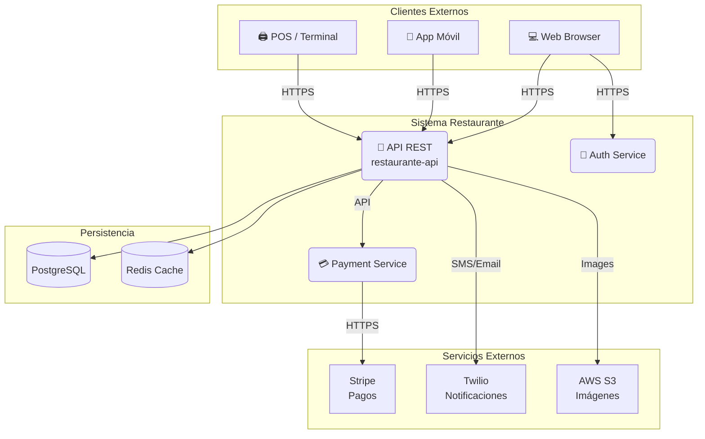

# Documentación de Pruebas y Validación de Reglas de Negocio

## Tipos de Cobertura de Pruebas (Branch y Loop Coverage)

### Explicación de conceptos teóricos
La cobertura (coverage) evalúa estadísticamente qué porción del código se ejecuta durante las pruebas.
- **Line Coverage**: Porcentaje de líneas ejecutadas al menos una vez.
- **Branch Coverage**: Asegura que cada rama lógica de decisiones (if/else) se recorra.
- **Loop Coverage**: Asegura que los ciclos iterativos se prueben ejecutándose 0, 1 y Múltiples (N) veces.
- **Condition / Path Coverage**: Verificación exhaustiva de subcondiciones booleanas individuales y todos los posibles caminos del programa.

### Detalle de la implementación paso a paso
1. Se analizó el método interno `validarYCompletarItems` en `PedidoServiceImpl.java` que integra un ciclo para procesar ítems de pedido.
2. Se agregaron pruebas para **Loop Coverage**, evaluando arreglos vacíos (0 iteraciones) y pedidos con múltiples ítems (N iteraciones).
3. Se agregaron pruebas orientadas al **Branch Coverage** forzando ramas huérfanas: rechazo de platos no disponibles, saltos de lógica si no es pizza ni pasta, rechazos por salsas vacías y límites de frontera exactos (5 toppings).
4. Se ejecutó `mvn test` certificando que todo el flujo condicional quedó amparado bajo pruebas de éxito.

### Aspectos claves
- Alcanzar el 100% en Line Coverage no es garantía de flujo lógico seguro (Branch).
- La importancia del Mocking exhaustivo para someter al iterador a todos los escenarios de estrés de negocio sin acoplarse a la base de datos.

### Resumen
Se consolidó Branch Coverage y Loop Coverage total dentro del núcleo de validación de pedidos, evadiendo pruebas redundantes y blindando verdaderamente el código contra flujos condicionales alternos.

### Respuesta a preguntas teóricas
🧠 **Preguntas de Repaso — Cobertura**

**¿Qué diferencia hay entre Branch Coverage y Condition Coverage?**
Branch ve si cada camino del if/else se ejecutó. Condition mira cada sub-condición booleana dentro de la decisión por separado.

**¿Es posible tener 100% Line Coverage y 0% Branch Coverage?**
Sí — si solo hay código en el bloque if y nunca se prueba el else, todas las líneas se ejecutan pero la rama else no.

**¿Por qué Path Coverage es la más difícil de lograr?**
Porque el número de caminos crece exponencialmente con cada decisión. Con n decisiones hay 2ⁿ caminos posibles.
---

## Resolución de Pendientes (Integración y Seguridad)

### Explicación de conceptos teóricos
Las pruebas de integración determinan cómo interactúan armónicamente varios módulos del sistema (Controladores, Excepciones Globales y Servicios). En un entorno asegurado con Spring Security, testear un Controlador requiere el aislamiento de los filtros de autenticación mediante perfiles o dependencias mockeadas para no romper el Contexto de Spring.

### Detalle de la implementación paso a paso
1. Se solucionó el fallo base de `SecurityTest` migrando de un test general a `@WebMvcTest` e inyectando las dependencias que los filtros reclamaban (`JwtUtil`, `JwtAuthFilter`, `UsuarioRepository`) usando `@MockBean`.
2. Se comprobó el endpoint de platos verificando que emitiese con éxito los códigos `401 Unauthorized` y `403 Forbidden`.
3. Se construyó el integration test `CuentaControllerTest.java` invocando al `MockMvc`.
4. Se forzó el error de pago bloqueado y se verificó que `GlobalExceptionHandler` interceptara la `ReglaDeNegocioException` transformándola en el código HTTP 422 esperado por el cliente API.

### Aspectos claves
- Aislamiento del contexto usando `WebMvcTest` para aligerar la carga de base de datos.
- Traducción garantizada de excepciones Java a respuestas HTTP a través del middleware.
- Inyección simulada (`MockBean`) de las herramientas de token JWT.

### Resumen
Se reparó la suite integrando seguridad testeada aisladamente y se elaboró una prueba de integración comprobando que las severas restricciones del negocio impidan acciones no autorizadas propagando mensajes HTTP semánticamente correctos hacia el frontend.

---

## SECCIÓN 02: Sistemas con Estado vs Sin Estado

### Explicación de conceptos teóricos
La arquitectura define cómo el servidor gestiona la identidad de los clientes.
- **Sistemas con Estado (Stateful):** El servidor guarda el contexto de la sesión en su memoria entre peticiones. Es útil para flujos largos, pero demanda recursos del servidor y dificulta el escalamiento horizontal.
- **Sistemas Sin Estado (Stateless):** Cada petición es totalmente independiente. El cliente debe enviar todo lo necesario (ej. un token JWT). Es más simple, escalable y es la base de las APIs REST puras.

### Detalle de la implementación paso a paso
1. Se identificó la necesidad de implementar una autenticación escalable para la API REST del restaurante.
2. Se configuró Spring Security (`SecurityConfig`) para que gestione un flujo **Stateless** (creación de sesión en política `STATELESS`).
3. Se integraron filtros personalizados (`JwtAuthFilter`) donde el cliente envía un token JWT en lugar de depender de una sesión de servidor.
4. Para flujos protegidos, el cliente realiza la petición enviando el contexto (`Bearer Token`), lo cual el servidor valida en tiempo real sin requerir memoria de estado previa.

### Aspectos claves
- En un modelo Stateful, el servidor valida credenciales una vez y confía en el identificador de sesión. En Stateless, el cliente envía el Token en cada iteración.
- Restricción del escalamiento vertical/horizontal: Stateless permite distribuir peticiones a múltiples servidores libremente.
- JWT es ideal para entornos Stateless al contener los "Claims" (información) en sí mismo.

### Resumen
Se estructuró la seguridad de la aplicación bajo el modelo Stateless, eliminando el coste en recursos por sesiones almacenadas y confiando en JSON Web Tokens (JWT) para la autorización por petición, facilitando el crecimiento horizontal de la arquitectura.

---

## SECCIÓN 03: Arquitectura Cliente–Servidor & MVC en Capas

### Explicación de conceptos teóricos
El patrón Cliente-Servidor se fundamenta en tres reglas de oro: el cliente pide y el servidor responde (nunca al revés), el servidor es Stateless (no recuerda al cliente), y múltiples clientes hablan con un único servidor.
Internamente, el servidor aplica un patrón de capas (MVC) para dividir responsabilidades:
- **Controller (El Mesero):** Recibe la petición HTTP y extrae datos. NO contiene lógica de negocio.
- **Service (La Cocina):** Contiene las reglas del dominio y lógica de negocio. NO conoce el protocolo HTTP.
- **Repository (La Despensa):** Ejecuta acceso a Base de Datos (JPA/SQL). NO contiene lógica del negocio ni de la API.
- **Client (El Proveedor):** Abstrae consumo de servicios o APIs de terceros.

### Detalle de la implementación paso a paso
1. El **Cliente** (Navegador/App/Postman) emite un Request (HTTP + Body + Headers) hacia la API.
2. La capa `@RestController` captura la solicitud, formatea los parámetros y delega el flujo al servicio.
3. La capa `@Service` procesa la lógica central, validando restricciones y realizando las operaciones del restaurante.
4. La capa `@Repository` interactúa con la persistencia (PostgreSQL/MongoDB) mediante consultas CRUD.
5. El flujo retorna a través de las capas hasta que el servidor emite el Response (JSON + Status Code) al cliente.

### Aspectos claves
- **Separación de Responsabilidades:** Es un error crítico poner lógica de negocio en el Controller o hacer consultas de BD desde allí. Respetar las fronteras hace que el código sea testeable y mantenible.
- Cada capa asume su rol específico, garantizando que si se cambia la tecnología web o la base de datos, el núcleo (Service) permanezca intacto.

### Resumen
Se aplicó estrictamente el patrón MVC en capas, asegurando un modelo Cliente-Servidor escalable donde el Controller enruta, el Service valida y procesa, y el Repository persiste los datos, blindando la mantenibilidad a largo plazo del código.
---

## SECCIÓN 04: DTOs, Records, Enums, Entidades, MapperIn/Out & MapStruct

### Explicación de conceptos teóricos
La transferencia de datos se rige por capas estrictas usando objetos especializados:
- **DTO (Data Transfer Object):** Transporta datos entre el cliente y el servidor. Se implementan en Java usando `records` para garantizar inmutabilidad.
- **Entidad de Negocio:** Es la representación pura del dominio. Contiene toda la lógica y reglas. NO es un modelo de base de datos.
- **Modelo de BD (@Entity):** Refleja la estructura de las tablas en persistencia (JPA).
- **MapperIn:** Se encarga de convertir datos que entran al núcleo (RequestDTO -> Entidad de Negocio, Modelo BD -> Entidad de Negocio).
- **MapperOut:** Se encarga de convertir datos que salen del núcleo (Entidad de Negocio -> ResponseDTO, Entidad de Negocio -> Modelo BD).
El uso de la librería **MapStruct** permite generar todo este código de conversión en tiempo de compilación sin penalizar el rendimiento (Reflection) como lo haría ModelMapper.

### Detalle de la implementación paso a paso
1. Se analizaron las firmas de los Controladores y Servicios actuales. Se identificó que el proyecto ya separa los DTOs usando `records` inmutables (ej. `PedidoRequestDTO`).
2. El sistema diferencia explícitamente entre `Pedido` (Dominio con reglas) y `PedidoEntity` (Persistencia JPA).
3. Se utilizan Interfaces de MapStruct para transformar automáticamente propiedades. Cuando los nombres difieren, se aplican anotaciones como `@Mapping(source = "x", target = "y")` o `@Mapping(target = "x", ignore = true)`.

### Aspectos claves
- **Clean Architecture:** Al desacoplar la Web del Dominio, el Service debe operar exclusivamente con Entidades de Negocio, delegando a los Mappers la transformación.
- **MapStruct sobre ModelMapper:** Los errores de mapeo con MapStruct saltan durante el empaquetado (tiempo de compilación), mientras que ModelMapper falla en Runtime.
- Diferencia de roles: Una `@Entity` es un mapeo de fila de base de datos; una *Entidad de Negocio* valida que una pizza no tenga más de 5 toppings.

### Resumen
El proyecto aísla sus reglas de negocio de la capa web y persistencia mediante el uso de MapStruct y DTOs inmutables, garantizando que el núcleo solo trabaje con modelos válidos de negocio y previniendo fugas de información sensible hacia el cliente o exposición directa de la base de datos.

---

## SECCIÓN 05: Diagramas de Componentes

### Explicación de conceptos teóricos
Los diagramas de componentes modelan la arquitectura del software mostrando las piezas estructurales y sus relaciones. Se dividen principalmente en dos niveles:
- **Diagrama General (Contexto/Arquitectura):** Muestra la arquitectura global y cómo se integra con sistemas externos (APIs, bases de datos, nubes).
- **Diagrama Específico (Interno):** Muestra la arquitectura dentro de un solo aplicativo. Evidencia la organización de sus módulos internos y el respeto por el patrón de capas.
*Nota académica:* En entregas formales, se deben usar símbolos UML formales (componentes con rectángulos pequeños, puertos, interfaces tipo 'lollipop', etc.).

### Detalle de la implementación paso a paso
1. Se estructuró el **Diagrama General** representando la interacción de los tres tipos de clientes (Web, Móvil, POS) consumiendo los servicios expuestos del Sistema Restaurante, y la delegación de este a las bases de datos y a servicios de terceros (AWS, Stripe, Twilio).
2. Se estructuró el **Diagrama Específico** representando el MVC interno de `restaurante-api`. Se visualizan los flujos desde el Controller hacia el Service y de ahí al Repository, siempre inyectando los modelos transversales.

### Aspectos claves
- Es vital separar la vista de "Negocio/Arquitectura" de la vista de "Código/Estructura".
- El flujo interno en el diagrama específico garantiza la unidireccionalidad de las dependencias (`Controller -> Service -> Repository`).

### Resumen
Se construyeron dos representaciones visuales generativas mediante código Mermaid. Estas logran abstraer desde el ecosistema completo del restaurante hasta la minuciosa separación de responsabilidades dentro de las carpetas de la aplicación Java.

### Código de Diagramas (Mermaid)

**Diagrama General — Sistema Restaurante (Vista Externa)**


**Diagrama Específico — Componentes Internos (`restaurante-api`)**
```mermaid
graph TD
    subgraph Capa Controller
        C1[MenuController<br>@RestController]
        C2[PedidoController<br>@RestController]
        C3[ReservaController<br>@RestController]
    end

    subgraph Capa Service
        S1[MenuService<br>@Service]
        S2[PedidoService<br>@Service]
        S3[ReservaService<br>@Service]
        S4[NotificacionClient<br>@Component]
    end

    subgraph Capa Repository
        R1[MenuRepository<br>JpaRepository]
        R2[PedidoRepository<br>JpaRepository]
        R3[ReservaRepository<br>MongoRepository]
    end

    subgraph Modelos
        M1[DTOs / Records]
        M2[Enums]
        M3[@Entity / @Document]
        M4[Mappers]
    end

    C1 -.-> M1
    C1 -.-> M4
    C1 --> S1
    
    C2 -.-> M1
    C2 -.-> M4
    C2 --> S2
    
    C3 -.-> M1
    C3 -.-> M4
    C3 --> S3
    
    S1 -.-> M3
    S1 --> R1
    
    S2 -.-> M3
    S2 --> R2
    S2 --> S4
    
    S3 -.-> M3
    S3 --> R3
    S3 --> S4
```

---

## SECCIÓN 06: Diseño de APIs REST

### Explicación de conceptos teóricos
REST (Representational State Transfer) es un conjunto de principios arquitectónicos que define cómo deben diseñarse los servicios web usando el protocolo HTTP. La filosofía central de REST se basa en dos pilares:
1. **Uso correcto de verbos HTTP:**
   - **GET:** Seguro e idempotente. Solo lee recursos.
   - **POST:** No seguro y no idempotente. Crea nuevos recursos.
   - **PUT:** No seguro, pero idempotente. Reemplaza el recurso completo.
   - **PATCH:** No seguro, usualmente usado para actualizaciones parciales.
   - **DELETE:** No seguro, pero idempotente. Elimina un recurso.
2. **URL Design basado en Recursos (Sustantivos):** Las URLs deben estar compuestas por sustantivos plurales y jerarquías lógicas (ej. `/mesas/1/cuentas`), evitando el uso de verbos en la URL, ya que la "acción" ya viene descrita por el propio verbo HTTP.

### Detalle de la implementación paso a paso
1. Se analizaron todos los controladores expuestos (`PlatoController`, `PedidoController`, `MesaController`, `CuentaController`).
2. Se identificaron infracciones a las reglas de diseño REST, donde se incluían verbos en las rutas, como `/actualizar-total`, `/pagar`, `/abrir-cuenta`.
3. Se refactorizaron estas rutas hacia sustantivos que representan recursos o propiedades de recursos:
   - `/actualizar-total` $\rightarrow$ `/total`
   - `/pagar` $\rightarrow$ `/pago`
   - `/abrir-cuenta` $\rightarrow$ `/apertura-cuenta`
   - `/cerrar-cuenta` $\rightarrow$ `/cierre-cuenta`
   - `/disponible` $\rightarrow$ `/disponibilidad`
4. Se actualizaron en paralelo los contratos Swagger en las interfaces (`CuentaApi`, `MesaApi`, etc.) y las pruebas de integración (`CuentaControllerTest`).

### Aspectos claves
- **Idempotencia:** Significa que efectuar la misma petición 1 o N veces producirá exactamente el mismo estado final en el servidor. Esto es vital para manejar reintentos seguros en redes inestables (ej. si falla un PUT, puedes volver a intentarlo sin miedo).
- **Manejo de estados con PATCH:** Cuando no es posible usar un recurso hijo, actualizar una propiedad de estado (ej. `/pago`) mediante un PATCH es la forma más limpia y compatible con los principios REST.
- **Nomenclatura Consistente:** Las URLs ahora utilizan exclusivamente _kebab-case_ y sustantivos plurales.

### Resumen
La API del restaurante ahora es estrictamente RESTful. Los nombres de los endpoints ya no dictan acciones mediante verbos en la ruta, sino que el sistema delega esa responsabilidad de semántica al verbo HTTP elegido (GET, POST, PATCH), apoyado de URLs limpias compuestas únicamente por sustantivos organizados jerárquicamente.

### 🧠 Preguntas de Repaso — APIs REST
**¿Por qué GET es considerado "seguro"?**
Porque nunca modifica el estado del recurso en el servidor — solo lee y devuelve datos.

**¿Cuál es la diferencia entre PUT y PATCH?**
PUT reemplaza el recurso completo enviado en la solicitud. PATCH solo modifica los campos o propiedades especificadas en el body.

**¿Por qué usar `/restaurants/{id}/orders` en vez de `/getOrdersOfRestaurant`?**
REST usa sustantivos y jerarquías, no verbos. Los verbos HTTP ya expresan la acción requerida, manteniendo las rutas como identificadores estáticos de recursos.

---

## SECCIÓN 07: Inyección de Dependencias, Interfaces, IoC & Spring + Lombok

### Explicación de conceptos teóricos
- **Principio de Inversión de Dependencias (DIP):** Los componentes de alto nivel no deben depender de los componentes de bajo nivel. Ambos deben depender de abstracciones (interfaces). Esto fomenta el bajo acoplamiento y la alta cohesión.
- **Inversión de Control (IoC):** En lugar de que el desarrollador instancie los objetos (`new Clase()`), el framework (Spring IoC Container) asume el control del ciclo de vida de los objetos (Beans), escaneando las clases, detectando sus necesidades e instanciándolas automáticamente.
- **Inyección de Dependencias (DI):** Es el patrón de diseño mediante el cual el contenedor IoC entrega (inyecta) a una clase los objetos que necesita para funcionar.
- **Reflection:** Técnica usada por Spring para analizar las clases, leer sus anotaciones (`@Service`, `@RestController`) y crear instancias dinámicamente en tiempo de ejecución.

### Detalle de la implementación paso a paso
1. **Verificación de Interfaces:** Se confirmó que todos los Controladores dependen exclusivamente de Interfaces (`IAuthService`, `IMesaService`, `IPedidoService`, etc.) en lugar de depender de sus implementaciones concretas (`AuthServiceImpl`, etc.), cumpliendo con DIP.
2. **Eliminación de constructores manuales (Boilerplate):** Se rastrearon todos los constructores manuales creados en las capas `@RestController` y `@Service`.
3. **Refactorización con Lombok:** Se eliminaron los constructores y se decoraron las clases con `@RequiredArgsConstructor` de Lombok. Las dependencias inyectables fueron declaradas explícitamente como `private final`.

### Aspectos claves
- La inyección recomendada en Spring es por **Constructor**. Garantiza la inmutabilidad de la dependencia (`final`) y que la clase no se instancie si las dependencias no están listas (falla rápido).
- Evitar siempre la inyección por atributos (`@Autowired` sobre el campo directo), ya que rompe la inmutabilidad y dificulta el paso de Mocks en pruebas unitarias puras (sin levantar contexto Spring).
- Combinar **Constructor Injection** con `@RequiredArgsConstructor` produce código más limpio, fácil de leer y libre de constructores largos y repetitivos (boilerplate).

### Resumen
La arquitectura actual implementa el Principio de Inversión de Dependencias a la perfección: el Controller no sabe cómo la lógica de negocio guarda los datos, y el Service no sabe qué base de datos se usa; todo se comunica mediante "contratos" definidos en Interfaces. La refactorización del código eliminó los constructores manuales para apoyarse inteligentemente en el framework de Lombok, forzando la inyección segura por constructor orquestada por el contenedor IoC de Spring.

### 🧠 Preguntas de Repaso — DI, Interfaces e IoC
**¿Por qué en el Controller ponemos IPedidoService (interfaz) y no PedidoServiceImpl?**
Para depender de la abstracción, no del detalle. El Controller solo sabe qué puede hacer el servicio (su contrato), no cómo lo implementa internamente. Esto permite sustituir la implementación en el futuro sin modificar la capa Controller.

**¿Qué hace `@RequiredArgsConstructor` de Lombok?**
Genera, en tiempo de compilación, un constructor público con todos los campos declarados como `final`. Spring detecta ese constructor único y lo usa para autoconectar (inyectar) las dependencias.

**¿Cuál es la diferencia entre IoC e Inyección de Dependencias?**
IoC (Inversión de Control) es el principio o patrón arquitectónico más general donde el Framework controla el ciclo de vida de los objetos en lugar del programador. La Inyección de Dependencias (DI) es la técnica concreta mediante la cual se aplica el IoC para poblar las dependencias requeridas de una clase.

**¿Qué pasaría si tienes dos clases que implementan `IPedidoService`?**
Spring arrojaría una excepción (`NoUniqueBeanDefinitionException`) al intentar arrancar el ApplicationContext debido a la ambigüedad, pues no sabría cuál variante inyectar. Esto se soluciona marcando una implementación preferida con `@Primary` o utilizando `@Qualifier("nombreDelBean")` en el sitio de inyección.

---

## SECCIÓN 08: Spring Boot — Anotaciones Esenciales

### Explicación de conceptos teóricos
Spring Boot es un framework empresarial para construir aplicaciones Java independientes, de producción, con configuración automática y enfoque obstinado ("opinionated"). Se basa fuertemente en anotaciones para marcar clases y métodos, permitiendo al IoC Container gestionarlos.
Anotaciones clave:
- `@SpringBootApplication`: Combina `@Configuration`, `@ComponentScan` y `@EnableAutoConfiguration`.
- `@RestController`: Marca la clase como controlador REST (combina `@Controller` + `@ResponseBody`).
- `@RequestMapping`: Define la ruta base del controller.
- `@GetMapping` / `@PostMapping`: Mapea un método HTTP a un endpoint específico.
- `@Service`: Marca la clase como lógica de negocio (gestionada por Spring).
- `@Repository`: Marca acceso a datos y habilita traducción de excepciones de BD.
- `@Component`: Clase genérica gestionada por Spring.
- `@Entity`: Mapea la clase a una tabla en BD relacional (JPA).
- `@Document`: Mapea la clase a una colección en MongoDB.

### Detalle de la implementación paso a paso
1. Se revisó la clase principal `RestauranteApplication`, confirmando el uso de `@SpringBootApplication` para arrancar el contexto y escanear componentes.
2. Se validaron los Controladores (`AuthController`, `MesaController`, etc.), confirmando el uso de `@RestController` y `@RequestMapping` para definir las rutas base.
3. Se revisaron los endpoints para asegurar el uso correcto de anotaciones de verbo HTTP (`@GetMapping`, `@PostMapping`, `@PutMapping`, `@PatchMapping`, `@DeleteMapping`).
4. Se constató que las clases de dominio que mapean a persistencia usan `@Entity` para PostgreSQL (`PedidoEntity`, `PlatoEntity`) y `@Document` para MongoDB (`EventoPedidoDocument`).

### Aspectos claves
- `@ComponentScan` es crucial porque le indica a Spring en qué paquetes buscar clases anotadas para agregarlas al IoC Container.
- `@RestController` serializa automáticamente las respuestas a formato JSON (al incluir internamente `@ResponseBody`), a diferencia de `@Controller` que busca resolver vistas HTML.
- Se debe diferenciar claramente `@Entity` (JPA/Relacional) de `@Document` (NoSQL/MongoDB) según el tipo de repositorio que consuma la clase.

### Resumen
La aplicación hace un uso idóneo y extensivo de las anotaciones de Spring Boot, permitiendo configurar el enrutamiento HTTP, la inyección de dependencias, la lógica de negocio y el mapeo objeto-relacional (o documental) de manera declarativa y limpia, sin necesidad de configuraciones XML complejas.

### 🧠 Preguntas de Repaso — Spring Boot
**¿Por qué se recomienda inyección por constructor en vez de `@Autowired` en el campo?**
Porque facilita las pruebas unitarias (puedes pasar un mock), hace explícitas las dependencias y permite campos final (inmutables).

**¿Qué diferencia hay entre `@Entity` y `@Document`?**
`@Entity` es para bases de datos relacionales (JPA/Hibernate). `@Document` es para MongoDB (Spring Data MongoDB).

**¿Qué hace `@ComponentScan`?**
Le dice a Spring en qué paquetes buscar clases anotadas (`@Component`, `@Service`, etc.) para agregarlas al contexto (IoC Container).

**¿Cuál es la diferencia entre `@Controller` y `@RestController`?**
`@RestController` = `@Controller` + `@ResponseBody`. Los métodos de `@RestController` devuelven datos directamente (JSON) en vez de nombres de vistas.


