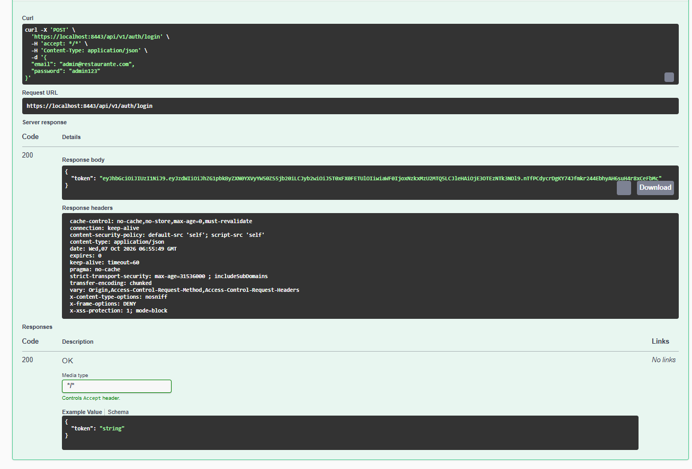
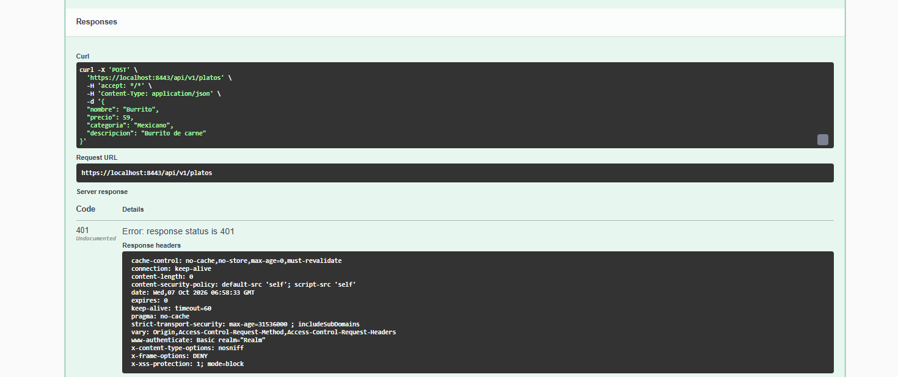
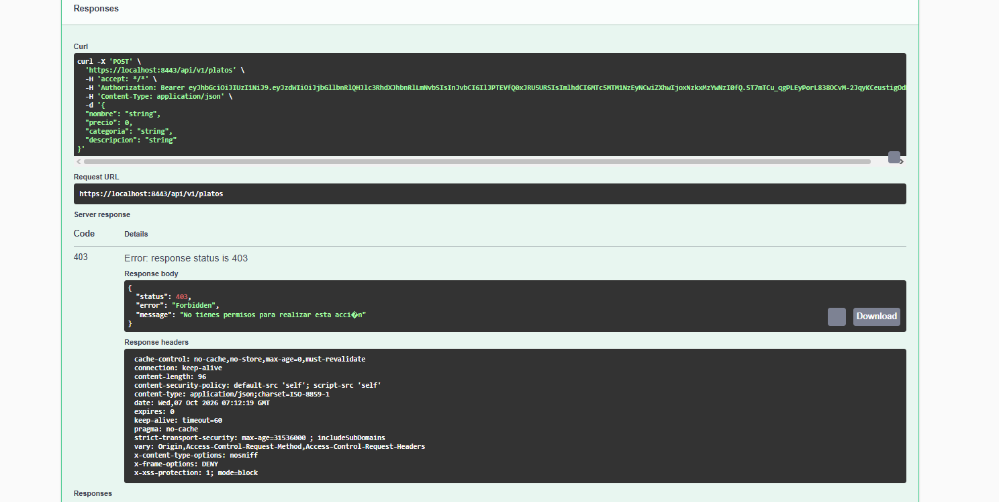
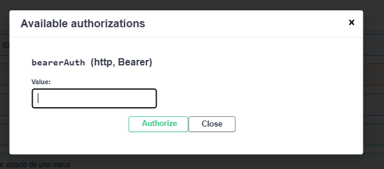
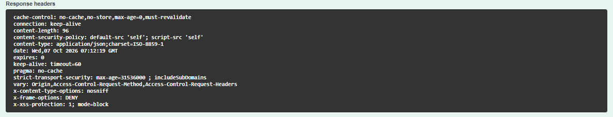
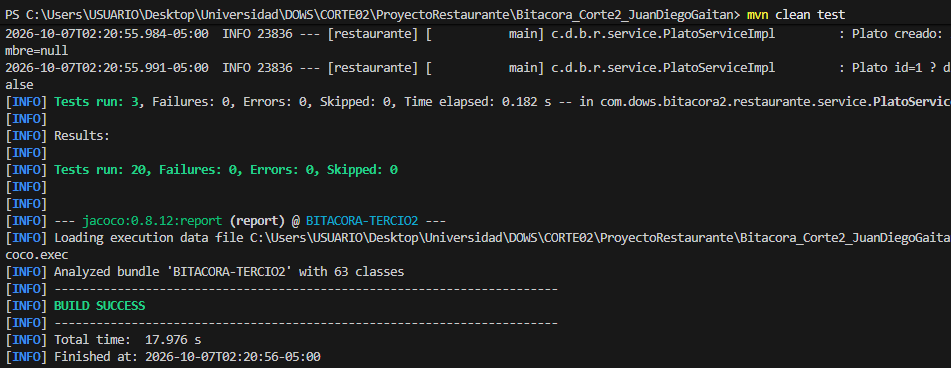

# Seguridad del Backend

Este documento detalla la configuración de seguridad, políticas de acceso y mitigación de vulnerabilidades implementadas en la API REST de Bella Ciao Restaurante.

## Tabla de Roles y Permisos por Endpoint

| Endpoint | Método HTTP | Acceso Permitido | Regla Spring Security | Justificación |
| :--- | :--- | :--- | :--- | :--- |
| `/api/v1/platos` | GET | Público | `permitAll()` | La carta debe ser visible sin autenticar. |
| `/api/v1/platos` | POST | Administrador | `hasRole("ADMIN")` | Solo el administrador crea nuevos platos. |
| `/api/v1/platos/{id}` | PUT, DELETE | Administrador | `hasRole("ADMIN")` | Modificación y eliminación estructural de platos. |
| `/api/v1/pedidos` | GET | Mesero, Cocina, Admin | `hasAnyRole("MESERO", "COCINA", "ADMIN")` | Listado general operativo para empleados. |
| `/api/v1/pedidos` | POST | Cliente, Mesero | `hasAnyRole("CLIENTE", "MESERO")` | Creación de pedidos autónoma o presencial. |
| `/api/v1/pedidos/{id}/estado` | PATCH | Cocina, Mesero | `hasAnyRole("COCINA", "MESERO")` | Transición de estados de pedidos en el flujo del restaurante. |
| `/api/v1/mesas` | GET | Cliente, Mesero, Admin | `hasAnyRole("CLIENTE", "MESERO", "ADMIN")` | Visualización de disponibilidad de capacidad. |
| `/api/v1/mesas/{id}/abrir-cuenta` | PATCH | Cliente, Mesero | `hasAnyRole("CLIENTE", "MESERO")` | Inicio de servicio en la mesa. |
| `/api/v1/cuentas/{id}/pagar` | PATCH | Mesero | `hasRole("MESERO")` | Cierre financiero. Solo el mesero procesa el pago final. |

## Evidencias de Pruebas Manuales

A continuación, se presentan los espacios para adjuntar las capturas de pantalla de la auditoría de seguridad:

### Captura del login exitoso en Swagger (Request + Respuesta con JWT)

### Captura de 401 al llamar sin token

### Captura de 403 al llamar con rol incorrecto

### Captura del botón "Authorize" en Swagger UI con el token ingresado

### Captura de los headers de seguridad en Postman (X-Frame-Options, etc.)

## Checklist OWASP Top 10

| Vulnerabilidad | Aplica | Estrategia de Mitigación Implementada |
| :--- | :--- | :--- |
| **A1 Broken Access Control** | Sí | Se implementó Control de Acceso Basado en Roles (RBAC) dual: mediante rutas en SecurityConfig y anotaciones @PreAuthorize en los controladores. |
| **A2 Cryptographic Failures** | Sí | Todo el tráfico viaja cifrado bajo HTTPS (SSL/TLS). Las contraseñas se hashean con BCrypt y los JWT se firman con HS256 usando llaves fuertes. |
| **A3 Injection** | Sí | Interacción exclusiva con bases de datos a través de Spring Data JPA y MongoRepository, utilizando Prepared Statements nativos que anulan la inyección. |
| **A4 Insecure Design** | Sí | Uso riguroso del patrón DTO (Data Transfer Object) para evitar la filtración accidental de entidades de la base de datos hacia el cliente. |
| **A5 Security Misconfiguration** | Sí | GlobalExceptionHandler oculta las trazas de error completas (500). Variables de entorno protegidas en el archivo .env excluido del control de versiones. |
| **A6 Vulnerable Components** | Sí | Gestión centralizada de versiones estables de dependencias a través de Maven Central. |
| **A7 Identif. & Auth Failures** | Sí | Implementación de Rate Limiting en AuthController (bloqueo automático tras 5 intentos fallidos) y manejo explícito de tokens JWT expirados, retornando código 401. |
| **A8 Software & Data Integrity** | Sí | Verificación estricta de la firma HMAC de cada token JWT mediante la librería jjwt para evitar alteración o manipulación de datos (Data Tampering). |
| **A9 Security Logging** | Sí | Implementación de SLF4J en filtros y controladores para auditar sistemáticamente accesos denegados (403), intentos fallidos de login y tokens corruptos. |
| **A10 SSRF** | No | La API no expone endpoints que requieran recibir URLs de destino procesadas del lado del servidor. |

## Verificación de Pruebas Automatizadas

Resultado de la ejecución del comando `mvn test` validando que la capa de seguridad responde a peticiones ilegítimas con estatus 401 y 403:

